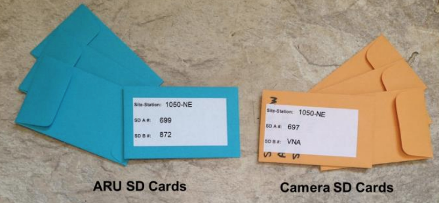
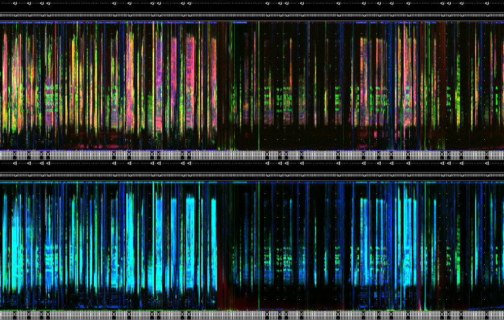

# Acoustic data pre-processing

## Acoustic data management basics

The first step after an ARU is retrieved from the field is to promptly download and secure the data to create a redundant backup. Having redundant backups not only protects against data loss but also ensures business continuity and minimizes downtime in the event of a system failure or natural disaster. Furthermore, in case there is an issue with the SD card copy during the quality control process, having a redundant backup ensures that a copy of the data can be restored.



### Acoustic metadata

In `wildRtrax` and WildTrax, there are a few essential components and standards that are required in order for the data to be utilized within this context:

- [**Location**](https://www.wildtrax.ca/home/resources/guide/organizations/locations.html): The physical, geographic place at which environmental sensors were deployed and/or biological data was collected on the landscape. This is how you associate spatial coordinates to the raw audio data (see [Geographic filtering](#geographic-filtering)). 
- **Date and time**: The temporal component of the audio recording. This is when the recording took place. Many time formats are possible but the recommended standard is `YYYYMMDDHHMMSSTZ` wherever possible.
- **Sample rate**: The frequency at which audio waveforms are captured during analog-to-digital conversion in the environment. Sampling rates of 44.1 kHz, 48 kHz, or 96 kHz are commonly used for capturing audio within the 20–20,000 Hz range. Higher sampling rates (>96 kHz) are employed to capture [ultrasonic species](#ultrasonic-data) as needed.


A **recording** is the raw media or audio file. The following data types are supported within `wildRtrax` package. They are implicitly related to how each model and type of ARU records data. See [Wildlife Acoustics](https://www.wildlifeacoustics.com/), [Frontier Labs](https://www.frontierlabs.com.au/bar-lt) and [Open Acoustic Devices](https://www.openacousticdevices.info/audiomoth) for examples to learn more. 

Audio files need to contain both spatial and temporal information which is the minimum required in order to upload media to WildTrax, e.g. `ABMI-538-SW_20220506_050000`, where `ABMI-538-SW` is the location and `20220506_050000` is the timestamp. Both these pieces of information can tell you when and where the recording took place.

:::: {.dangerbox data-latex=""}
::: {.left data-latex=""}
*Keep in mind*<br>
If the timestamp does not contain a timezone, you can add one if your location has spatial coordinates using `wt_audio_scanner`.
:::
::::

```{r}

location_name <- "ABMI-1025-SW"
timestamp <- "20220406_074500"
file_type <- ".wav"

# A standard file name from the ABMI
paste0(location_name, "_", timestamp, file_type)

```

Some additional file name recommendations include:

* Omitting leading zeros for numeric delimited content, e.g. use `OG-1-3-5` instead of `OG-01-003-05`, unless they serve a identification purpose, e.g. `3-0-A12` where `-0-` indicates the an absence of a treatment 
* Delimiters such as “-”, “_”, “@” are supported
* Location name strings that appear numeric (e.g. 35001) should be treated with caution when importing via csv
* Spaces and slashes “/” “\” in location names are not supported 
* “_000” suffixes from Wildlife Acoustics Kaleidoscope output (wac -> wav conversion) are supported

### Acoustic file formats

An audio file format is a digital file format used to store and transmit audio data. It defines how the audio data is organized, compressed, and encoded. Audio file formats can be categorized as uncompressed, lossless compressed, and lossy compressed formats.

Uncompressed formats, such as WAV store audio data without any compression, resulting in high-quality audio but larger file sizes. Lossless compressed formats, such as FLAC, compress the audio data without losing any information, resulting in smaller file sizes without any loss in quality. Lossy compressed formats, such as MP3, use data compression algorithms to reduce the file size by discarding some of the audio data, resulting in a lower-quality audio file.

Different audio file formats have different advantages and disadvantages, and their use depends on the intended application and specific requirements. `wildRtrax` strongly recommends recording raw audio data either in following formats:
 
* **wac** are proprietary, lossless compressed file formats developed by Wildlife Acoustics
* **wav** is the standard, ubiquitous uncompressed audio file format
* **flac** is a lossless compressed audio file format

:::: {.didyouknow data-latex=""}
::: {.left data-latex=""}
*Did you know?*<br>
When data are uploaded to WildTrax, the audio is converted and stored as flac.
:::
::::

**mp3** is a lossy compressed audio file format and works by reducing the accuracy of certain sound components, and eliminating others. It is not typically recommended for raw audio recordings (see [MacPhail et al. 2023]()). 

## Manipulating recordings

Monitoring programs often generate an enormous amount of audio data that exceeds human capacity to listen to. To overcome this challenge, we can select specific audio files for upload to WildTrax and processing using predetermined criteria. This approach not only prioritizes important data but also helps minimize data storage costs while maximizing processing power for calculating relevant biological metrics.

:::: {.dangerbox data-latex=""}
::: {.left data-latex=""}
*Keep in mind*<br>
If you're not an R user you can stop here and upload all of your recordings directly an organization on WildTrax. WildTrax however does not contain all the necessary data quality control measures to uptake data that are included in `wildRtrax`.

- Go to the organization on WildTrax
- Go to Manage > Upload Recordings to Organization
- Follow the steps in WildTrax to finalize data upload
:::
::::

### Reading files

The first step in data pre-processing is to determine what files exist. `wt_audio_scanner` is the function that provides the basis for the rest of the data pre-processing steps. The function recursively scans directories of audio data and returns standard metadata such as the file path, file name, file size, date, time, location name, that will later be used in WildTrax.

```r
files <- wt_audio_scanner(path = "../ABMI/ARU/ABMI-EH/2022/V1/228/228-NE", file_type = "wav", extra_cols = F)
```

```{r, warning=F, message=F, comment="", prompt=T}
head(files)

```

:::: {.didyouknow data-latex=""}
::: {.left data-latex=""}
*Did you know?*<br>
Directories of acoustic data at the ABMI are organized in the following hierarchy.

- [**Organization**](https://www.wildtrax.ca/home/resources/guide/organizations/organization-management.html): The institution or organization the data belongs to 
- **Sensor type**: ARU
- **Project**: A [project](https://www.wildtrax.ca/home/resources/guide/projects/project-management.html) is a  grouping of locations and recordings designed to answer an ecologically relevant question. Such programs at the ABMI include, Ecosystem Health (ABMI-EH), Before-After Dose Response (BADR). with location naming conventions such as ABMI-1025-SW and 2-0-A117, respectively.
- **Deployment Year**: The year the data was collected. Repeat visits of locations are defined in the year for things like trend data sets. 
- [**Visit**](https://www.wildtrax.ca/home/resources/guide/organizations/visits.html): A unique sequential key to define the year and visit the media collection took place, e.g. V1, V2, etc.
- **Group**: Is the delimited name of a location. It is aggregated in order to represent spatial relationships or clustering within the field project. (e.g. ABMI-1025-SW is the location but ABMI-1025 is the group given it defines a specific clustering of locations for the study design)
- [**Location**](https://www.wildtrax.ca/home/resources/guide/organizations/locations.html): is the joining key to WildTrax and also the base directory to the media
:::
::::


You can choose `extra_cols = T` you'll be supplied with additional columns that can be used to help select recordings, specifically sample rate, length (seconds) and number of channels.

```r
files_extra <- wt_audio_scanner(path = ../ABMI/ARU/ABMI-EH/2022/V1/228/228-NE", file_type = "wav", extra_cols = T)
```

```{r, comment="", prompt=T, warning=F, message=F}

files_extra

```

:::: {.dangerbox data-latex=""}
::: {.left data-latex=""}
*Keep in mind*<br>
Using the file name and file path from the output of `wt_audio_scanner` will determine what the location name and time stamp of the recording will be. If you notice that the location name or time stamp is incorrect, you should re-visit the raw audio and determine if it is correct. See the section [Linking acoustic data to WildTrax](#linking-acoustic-data-to-wildtrax) for more information.
:::
::::

### Segmenting audio files

It's possible that recordings are longer than the maximum length WildTrax can currently import (1800 seconds or 320MB). In this case, you can use `wt_chop` to create intervals of recordings.

```{r}

files_extra %>%
  select(location, recording_date_time, length_seconds) %>%
  slice(2) 

```


```r
# Select a 10 minute file and chop it into 60 second segments, creating 10 x 60 second files instead of one 10-minute file
wt_chop(input = fe, segment_length = 60, output_folder = "/my/output/folder")

```

`wt_chop` will create *modulo recordings* as needed; this refers to the remaining portion of the recording that is left over after it has been divided into equal intervals of the chosen duration. For example, if a recording is 120 seconds long and `segment_length = 50`, the modulo recording would be the final 20 seconds since 50 + 50 + 20 = 120. However, if the chosen interval duration is a factor of the total duration of the recording, there will be no modulo recording. For example, if a 120-second recording is divided into 60-second intervals, there will be no modulo recording since 60 is a factor of 120.

### Filtering audio files

At this stage, you can use the results from the `wt_audio_scanner` tibble output in order to select the files you're interested in. Filtering and selecting files generally aligns with the study design or species you're interested in capturing. Here's an example of the ABMI's Stratified Sampling Design for the Ecosystem Health Monitoring program that's used to pick recordings across a breadth of dates and times in order to maximize the species inventory collected at a location.  

```{r, eval = T, warning = F, message = F, include = T, comment="", prompt=T}

abmi_blocks <- as_tibble(data.frame(julian = 90:210) %>%
                     crossing(time_index = 1:4) %>%
                     mutate(blocks = case_when(julian %in% 90:139 & time_index == 1 ~ 9, # Midnights during the spring for owls
                                               julian %in% 140:159 & time_index == 1 ~ 10, # Midnights for amphibians, nocturnal breeders
                                               julian %in% 160:179 & time_index == 1 ~ 11, # Midnights for amphibians, nocturnal breeders
                                               julian %in% 180:210 & time_index == 1 ~ 12, # Midnights for amphibians, nocturnal breeders
                                               julian %in% 90:104 & time_index == 3 ~ 1, # Dawn in winter-spring for residents
                                               julian %in% 105:119 & time_index == 4 ~ 2, # Post-dawn in spring for residents, early arrivers
                                               julian %in% 120:139 & time_index == 3 ~ 3, # Dawn for early arrivers
                                               julian %in% 140:149 & time_index == 3 ~ 4, # Dawn for breeding bird chorus
                                               julian %in% 150:159 & time_index == 4 ~ 5, # Post-dawn breeding season
                                               julian %in% 160:169 & time_index == 3 ~ 6, # Dawn for breeding bird chorus
                                               julian %in% 170:179 & time_index == 4 ~ 7, # Post-dawn breeding season
                                               julian %in% 180:210 & time_index == 4 ~ 8, # Post-dawn late breeding season
                                               TRUE ~ NA_real_),
                            recs = case_when(blocks %in% c(4:7) ~ 180,
                                             TRUE ~ 60)))

head(abmi_blocks)

```

Now we can apply these blocks to a set of audio files and filter the desired recordings to the stratified design.

```{r, warning=F, message=F, prompt=T, comment=""}

files %>%
  inner_join(., abmi_blocks, by = c("julian" = "julian", "time_index" = "time_index")) %>%
  filter(!is.na(blocks)) %>% # Filter out recordings that don't fit in a block
  group_by(location, blocks) %>%
  sample_n(1, replace = F) %>%
  select(location, recording_date_time)

```

The Before-After Dose-Response program is another example of a sampling design. Here, we select four recordings near dawn and one recording at dusk for each location between Julian date 140 and 210, for a total of 15 audio minutes. Again, this approach allows users to maximize species diversity while accounting for processing effort.

```r
b <- wt_audio_scanner(path = "../2-0-A25", file_type = "wav", extra_cols = F)

# A list of locations donwload from My Organizations > Manage > Download Locations
locs <- read_csv("../locations.csv")

bz <- b %>%
  select(file_name:year) %>%
  inner_join(., locs, by = c("location")) %>%
  # Ensure time zone is correct
  mutate(recording_date_time = force_tz(recording_date_time, "US/Mountain")) %>%
  rowwise() %>%
  # Get sun angle, 6 degrees before dawn defines civil twilight period
  mutate(angle = pull(suncalc::getSunlightPosition(date = recording_date_time, lat = latitude, lon = longitude, keep = c("altitude"))) * (180/pi)) %>%
  ungroup() %>%
  filter(between(angle,-6,6),
         between(julian,140,210)) %>%
  mutate(hour = hour(recording_date_time))

# Sample one dusk recording
bz1 <- bz %>% 
  filter(hour %in% c(20:22)) %>%
  sample_n(1, replace = F)
# And four dawn recordings
bz2 <- bz %>% 
  filter(hour %in% c(4:7)) %>%
  sample_n(4, replace = F)

# Bind the dawns and dusks together
bzz <- bind_rows(bz1, bz2)
```

```{r, warning=F, message=F, include=T, eval=T, comment="", prompt=T}
head(bzz)

```

### Geographic filtering

Another example of selecting files may be geographic.

:::: {.dangerbox data-latex=""}
::: {.left data-latex=""}
*Keep in mind*<br>
That you need to manage spatial coordinates along with your locations in order to use these workflows.
:::
::::

Here's an example with selecting recordings with Bird Conservation Regions. 

```{r, eval=F, include=T, warning=F, message=F, comment="", prompt=F}
library(tidyverse)
library(sf)

# Clean up the locations
locs_next <- locs %>%
  filter(if_all(c(latitude, longitude), ~ !is.na(.))) %>%
  select(location, latitude, longitude) %>%
  distinct()

# Create a simple features object. Make it valid and set the CRS.
locsset <- st_as_sf(locs_next %>% select(location, latitude, longitude) %>% distinct(), coords = c("longitude","latitude"))
locsset <- st_make_valid(locsset)
locsset <- st_set_crs(locsset, 4269)

# Load a shapefile of Terrestrial BCRs of North America
bcrs <- read_sf("../BCR_Terrestrial.shp")

# Filter to just Alberta
bcrs <- st_make_valid(bcrs)
bcrs <- bcrs %>%
  filter(PROVINCE_S == "ALBERTA")
```

```{r, comment="", warning=F, message=F, prompt=T}
ggplot(bcrs) +
  geom_sf(aes(fill = BCRNAME)) +
  theme_bw() +
  scale_fill_viridis_d()

```

```{r, eval=F, include=T, warning=F, message=F, comment="", prompt=F}

# Intersect the locations with the BCRs
out <- st_intersection(locsset, bcrs)

# Join it to the original tibble
locss <- out %>%
  inner_join(., locs, by = c("location" = "location")) %>%
  # Now sample 10 locations per BCR 
  group_by(BCRNAME) %>%
  sample_n(10, replace = F) %>%
  select(location, BCRNAME)

```

```{r, comment="", warning=F, message=F, prompt=T}
locss %>%
  select(location, BCRNAME) %>%
  arrange(location)

```

```{r, eval=T, include=T, warning=F, message=F, comment="", prompt=F}
ggplot(bcrs) +
  coord_sf(crs = 4269) +
  geom_sf(aes(fill = BCRNAME)) +
  geom_sf(locss, mapping = aes()) +
  theme_bw() +
  theme(legend.position = "none") +
  scale_fill_viridis_d()

```

#### Landcover proportions

Ecologists often study the spatial proportions of different landcover types within a given area to understand the distribution and diversity of species, as well as the functioning of ecosystems. Landcover change, driven by human activities such as land use conversion and climate change, can alter spatial proportions and have significant impacts on ecosystem dynamics and services, highlighting the importance of monitoring and managing landcover patterns.

```r
# ABMI 2010 W2W Landcover
LP <- read_sf(".../Lancover_Polygons_2010.shp") %>%
  mutate(LC_name = case_when(LC_class == 20 ~ "Water",
                             LC_class == 31 ~ "Snow/Ice",
                             LC_class ==  32 ~ "Rock/Rubble",
                             LC_class == 33 ~ "Exposed Land",
                             LC_class == 34 ~ "Developed",
                             LC_class == 50 ~ "Shrubland",
                             LC_class ==  110 ~ "Grassland",
                             LC_class == 120 ~ "Agriculture",
                             LC_class ==  210 ~ "Coniferous Forest",
                             LC_class ==  220 ~ "Broadleaf Forest",
                             LC_class == 230 ~ "Mixed Forest"))

colours <- c("Water" = "#00BFFF", 
             "Snow/Ice" = "#FFFFFF", 
             "Rock/Rubble" = "#D3D3D3",
             "Exposed Land" = "#8B4513", 
             "Developed" = "#9400D3",
             "Shrubland" = "#008000",
             "Grassland" = "#ADFF2F",
             "Agriculture" = "#FFFF00",
             "Coniferous Forest" = "#006400",
             "Broadleaf Forest" = "#32CD32",
             "Mixed Forest" = "#808000")
```
```{r, include = T, eval=F, warning=F, message=F, comment="", prompt=T}

# Control locations from the Before-After Dose-Response Landscape Unit #2
badr2 <- locs %>%
  filter(grepl('^2-0',location))

# Big Grid 9 (Touchwood)
bu_locs <- bu_locs %>%
  filter(grepl('^BG-9', location))

bu_badr <- bind_rows(badr2, bu_locs) %>%
  mutate(Project = case_when(grepl('^BG-',location) ~ "Big Grids",TRUE ~ "Before-After Dose Response"))

bu_badr_map <- st_as_sf(bu_badr, coords = c("longitude","latitude")) 
bu_badr_map <- st_make_valid(bu_badr_map)
bu_badr_map <- st_set_crs(bu_badr_map, 4269)
bu_badr_map <- st_transform(bu_badr_map, 3400)
```

```{r, include = T, eval=T, warning=F, message=F, comment="", prompt=T}
onebadr <- bu_badr_map %>%
  filter(grepl('^BG-9',location))

onebadr_buff <- st_buffer(onebadr, 150)
onebadr_buff <- st_transform(onebadr_buff, 3400)

ggplot() +
  geom_sf(data = st_crop(LPP_c, xmin = 723300, xmax = 729250, ymin = 6076950, ymax = 6083050), aes(fill=LC_name)) +
  geom_sf(onebadr_buff, mapping = aes(), fill = NA, colour="white") +
  geom_sf(onebadr, mapping = aes(colour = Project)) +
  theme_bw() +
  scale_colour_viridis_d() +
  scale_fill_manual(values = colours)

```

```{r, include = T, eval=T, warning=F, message=F, comment="", prompt=T}

inp <- st_intersection(LPP_c, onebadr_buff) %>% 
   mutate(intersect_area = st_area(.)) %>%   # create new column with shape area
   dplyr::select(location, LC_name, intersect_area) %>%   # only select columns needed to merge
   st_drop_geometry() %>%
   group_by(location, LC_name) %>%
   summarise(intersect_area = sum(intersect_area)) %>%
   ungroup() %>%
   pivot_wider(names_from = LC_name, values_from = intersect_area) %>%
   mutate_all(~replace(., is.na(.), 0)) %>%
   mutate(across(-location, ~as.numeric(.x))) %>%
   rowwise() %>%
   mutate(total = sum(c_across(-location))) %>%
   ungroup() %>%
   mutate(across(-c(location,total), ~ .x / total)) %>%
   select(-total)

inp

```

## Other convenience functions: distance between locations

As ARUs are placed on the landscape by different organizations, or over time with different projects, it is possible that spatial locations may overlap. `wt_location_distances` takes a list of locations downloaded from WildTrax and calculates the distances between all pairs of points.

:::: {.didyouknow data-latex=""}
::: {.left data-latex=""}
*Did you know?*<br>
You can go to Manage > Download Locations in either a project or an organization to get a list of locations and their attributes. Remember, you need to be an organization administration to perform this operation since organizations manage locations.

:::
::::

```{r, warning=F, message=F}
ggplot() +
  geom_sf(bu_badr_map, mapping = aes(colour = Project)) +
  coord_sf(crs = 4269) + 
  theme_bw() +
  scale_colour_viridis_d() +
  scale_fill_manual(values = colours) +
  guides(shape = guide_legend(override.aes = list(alpha = 0.2)))

```

```r
distances <- wt_location_distances(input_from_tibble = bu_badr)

```

```{r, include = T, eval=T, warning=F, message=F, comment="", prompt=T}
# Filter points less then 100 meters apart
distances %>%
  filter(distance < 100) %>%
  arrange(distance) %>%
  filter(location_from < distance_to)

```


```r


```

### Error handling and file standardization

`wt_audio_scanner` will continue to support new file formats and file types. Error handling techniques are being put in place to identify and provide clear messages to users to ensure their data is standard to the WildTrax system before upload. [File standardization](#acoustic-data-management-basics) helps ensure consistency and prevent errors when transferring data across different systems and applications. With these measures, wt_audio_scanner can provide a reliable and versatile tool for working with various audio file formats. Development requests can be submitted as issues to the [GitHub repository](https://github.com/ABbiodiversity/wildRtrax/issues).

## Using acoustic indices and LDFCs



*Acoustic indices* and *long-duration false-colour (LDFC)* spectrograms are two tools used in the analysis of acoustic data developed by the [Towsey Lab at QUT](https://www.qut.edu.au/about/our-people/academic-profiles/m.towsey). 

Acoustic indices are numerical measurements that quantify various aspects of sound using different measurements that reflect the soundscpe. They are used to identify and track patterns of vocal activity over time, generate soundscape and monitor ecosystem-level patterns and changes. Some commonly known acoustic indices include the Acoustic Complexity Index (ACI), which measures the diversity of sound frequencies and amplitudes, and the Normalized Differenced Soundscape Index (NDSI), which measures the relative different between anthropophonic and biophonic sounds. 

Long-duration false-color spectrograms are visual representations of acoustic data using index values rather than spectral generation in order to provide detailed views of sound patterns over long periods of time. The use of false-colours allows for easier interpretation of the spectrogram, as different colors can be used to represent different types of sounds. These unique spectrograms are particularly useful in studies of animal vocalizations, as they allow researchers to identify specific vocalizations and track patterns of vocal activity over long periods of time, and determine seasonal phenology patterns. 

:::: {.dangerbox data-latex=""}
::: {.left data-latex=""}
*Keep in mind*
It's important to familiarize yourself with the **AP** software before continuing. See [here](https://ap.qut.ecoacoustics.info/) for full installation and support.
:::
::::

`wildRtrax` utilizes the results of the **AnalysisPrograms** software which generates the csv, json and png files associated to the results, and generates tidy versions of the data that can be joined to the media in order to select recordings based on index values and patterns. Let us demonstrate some different examples while introducing the `wt_run_ap` and `wt_glean_ap` functions.

```{r, include = T, eval=F, warning=F, message=F}
wt_run_ap()


```

```{r, include = T, eval=F, warning=F, message=F}
wt_glean_ap()


```


### Abiotic, geophonic and anthropophonic signal detection

Recorder failure, damaged microphones, or recorders that are placed in an environment where prevailing winds muffle the sounds the ARU can hear, such as in alpine environments, can limit the audio quality in order to process data in an effective way. ~12% of the acoustic data collected by the ABMI between 2015 - 2019 (~12TB / 100TB) had a relatively high geophonic index or a malfunction or failure. Due to the large volume of data that is handled, it is no longer efficient to do these processes manually and these steps should be automated as much as possible. The goals are to find efficient ways to screen and filter audio data with high geophony or to flag and omit recordings that will not be used for processing. 

```{r, eval=F, include=T, warning=F, message=F}

# Output the results
aqd <- wt_glean_ap(x = f2, input_dir = "../data", purpose = "abiotic")

```

In contrast, noise pollution is a pervasive problem in modern society, with detrimental effects on human health and well-being, wildlife, and ecosystems. There is growing interest in the use of acoustic indices for noise mapping applications. This approach has several advantages over traditional noise mapping methods. 

Using acoustic sensors at 310 spatial locations in 2021 across a gradient of human footprint. We recorded sounds for 4-5 days at each location between May and July calculated a range of acoustic indices. We also collected human observations of noise levels (ranked 0-3) and other noise sources (wind, rain, other noise and audio quality) using a standardized survey. We compared the acoustic indices to the human observations to determine the accuracy of the noise map generated from the indices.

```r
map_badr <- wt_glean(x = badr, input_dir = "../data", purpose = "abiotic")


```

### Biophonic signal detection

We can also look at the entire seasonal phenology of an ABMI Ecosystem Health site

```{r, eval=F, include=T, message=F, warning=F, prompt=T, comment=""}

boreal_example <- wt_glean_ap(x = boreal_site, input_dir = "../data")

boreal_example[[2]]

```


The great part about having a list of the `.png` files is that you can easily manipulate and generate new LDFCs with other attributes.

```{r, eval=F, include=T, message=F, warning=F, prompt=T, comment=""}

boreal_example[[2]] %>%
  mutate(hour = lubridate::hour(recording_date_time)) %>%
  filter(hour == 0) %>% # Look at only midnight LDFCs and acoustic index values
  map_dfr(~lapply(.))

```

While acoustic indices are good at detecting large scale patterns, it is more difficult to detect rare and elusive signals, especially those that exceed the signal-to-noise threshold to capture the signal. It is important to use this along with spectral validation in WildTrax to determine the source of the environmental noise.

## Linking acoustic data to WildTrax


### Collecting files for upload to WildTrax

To organize the process of uploading files to WildTrax smoother, it's recommended to collect all recordings into a single folder, regardless of where they are stored. Whether you've saved them on a server, hard drive, or local drive, this approach can help streamline the uploading process and save you time.

Depending on the operating system you're using, there are two common ways to handle your files: linking or copying. Linking involves creating a shortcut to the original file, while copying creates a new, duplicate file. Both options can be beneficial, especially if you have files stored in complex, nested structures.

### Recognizer results: transforming hits to tags

Wildlife Acoustics offers advanced tools for analyzing wildlife vocalizations. Two of their most popular programs are Songscope and Kaleidoscope that allows users to visualize and identify animal songs and calls and also create and run automated classifiers. The output files from these programs can be transformed into WildTrax tags to be uploaded for verification purposes. This is also the primary mechanism that ultrasonic data makes its way into the system if it is being analyzed in Kaleidoscope. 


#### Sonscope results

The function `wt_songscope_tags` reformats the output obtained from a Wildlife Acoustics Songscope recognizer. This transformation involves converting the recognizer tags into tags that do not have a method type. This makes it possible to upload each hit as a tag in a task.

```r
  
wt_songscope_tags(input = ".../ABMI-0585_CONIPeent3.4_20_50_results.txt",
                  output = "env", # Choosing env will save the output as a environment object called "songscope_tags"
                  species_code = "CONI",
                  method = "1SPT",
                  score_filter = 60,
                  vocalization_type = "Call",
                  task_length = 180)

```

```{r, eval=T, include=T, message=F, warning=F, prompt=T, comment=""}
songscope_tags

```

```{r, eval=T, include=T, message=F, warning=F, prompt=T, comment=""}

songscope_tags %>%
  pivot_longer(cols = Quality:Score, names_to = "Recognizer Variable") %>%
  ggplot(., aes(x=recordingDate,y=value)) + 
  geom_point(alpha = 0.1) + 
  geom_smooth(method="loess", aes(colour=`Recognizer Variable`)) +
  facet_wrap(~`Recognizer Variable`, scales="free_y") +
  theme_bw() +
  scale_colour_viridis_d() +
  ggtitle("Quality and Score Results")

```


:::: {.dangerbox data-latex=""}
::: {.left data-latex=""}
*Keep in mind*<br>
For certain monitoring programs that deliberately deploy ARUs over extended periods to detect specific species, a high true negative rate is crucial to confirm the absence of the species when required. This typically involves recording for more extended periods of more than 30 minutes. In such cases, it is advisable to use the `wt_chop` function to segment the media, upload the resulting recordings to WildTrax, generate a task list, and combine it with the results of `wt_songscope_tags` to import all the data into WildTrax.
:::
::::

#### Kaleidoscope results

[Kaleidoscope Pro](https://www.wildlifeacoustics.com/products/kaleidoscope-pro) is a software package that includes a collection of tools designed specifically for bioacoustics analysis work flows. It can be used to automatically identify bat calls and perform cluster analysis (which involves grouping similar calls together), and it also allows the creation and use of classifiers. Once you have used Kaleidoscope to analyze your audio recordings and identify bat calls, you can use the output from Kaleidoscope and transform them into tags using the `wt_kaleidoscope_tags` function. These tags can then be imported into WildTrax along with the media. 

```{r, include = T, eval=F, warning=F, message=F}


wt_kaleidoscope_tags()

```

It's also recommended to make a list of unique media associated to the tags so WildTrax can merge the audio and tags together.

```{r}


```

Once you have your formatted tags and audio prepared:

* Go to a project on WildTrax
* Click Manage > Upload Recordings to upload the media and generate the tasks
* Once the recordings are uploaded, click Manage > Upload Tags using the csv output from the `wt_kaleidoscope_tags` function. 

Note that `wt_kaleidoscope_tags`'s data wrangling is "lazy" in that it will attempt the enclose the majority of the signal detected from Kaleidoscope, and assign vocalization types globally. Users are encourage to use [Species Verification](https://www.wildtrax.ca/home/resources/guide/acoustic-data/species-verification.html) later in WildTrax in order to make the subsequent batch edits needed to the tags as needed. 

### Making tasks

```{r, include = T, eval=F, warning=F, message=F}
wt_make_aru_tasks()

```

Tasks don't always have to be recording or community based. Output from tags from Kaleidoscope or Songscope can also be used to generate tasks.

```r

```

Once your task csvs are created. Go to the desired project and begin the process up uploading them. 

:::: {.dangerbox data-latex=""}
::: {.left data-latex=""}
*Keep in mind*<br>
If you haven't uploaded recordings to WildTrax yet, you may as well just filter a set of desired files and upload them while generating this task, skipping this step.
:::
::::

```r


```

### Avoiding conflict errors

When you upload a recording to WildTrax, it will be permanently stored in the organization in its native length, regardless of whether you generated a task shorter than the recording duration during the initial upload. If you attempt to upload the same recording again, a conflict will arise. To avoid this, it is necessary to first download the list of recordings from the organization, filter out the recordings you plan to upload, and then create a filtering protocol for the remaining recordings. By following this process, you can ensure that there are no conflicts and that all of your recordings are properly organized and managed within WildTrax.
