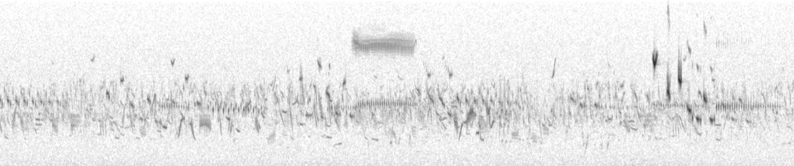

# Acoustic data analysis

## Authorizing and downloading data from WildTrax

To access WildTrax data using R, you need to follow a series of initial steps.

You should set up your credentials by logging in to WildTrax using Auth0 and storing your username and password as environment variables. 

```r 
Sys.setenv(WT_USERNAME = "guest", WT_PASSWORD = "Apple123")
```

Then, you can authenticate your credentials using the `wt_auth()` function. Once authenticated, you can use various functions to call upon the WildTrax API and download data. For example, the `wt_get_download_summary()` function provides basic metadata about projects that are available for download.

```{r, include = T, eval=F, warning=F, message=F}
wt_auth()


```

```r
wt_get_download_summary()
```

```r
wt_download_report()
```

## Wrangling data for analysis

### Species identification and observer error

Avian population monitoring relies on skilled observers who identify species and estimate population size using visual or acoustic cues. Passive field-based surveys, like "point counts," use distance and time-interval sampling to calculate meaningful metrics such as population size or density. ARU technology has replaced human-based surveys, establishing them as the new standard for bird population monitoring. False positives (FP) and false negatives (FN) in avian datasets are rarely reported, and standardized reporting, assessing, and determining actions to resolve avian identification errors are crucial. By creating open datasets, researchers can merge them together allowing for larger coproduced [Westwood et al.] and reproducible analyses [REFERENCE]. The integration of traditional human-collected and acoustic data is key to avian monitoring management implications and conservation goals.

A standardized system of reporting, assessing and determining actions to resolve avian identification error is crucial to ensure that reporting meets a high data quality standard and that it can be used comfortably in aggregation with other data to answer a wider range of scientific questions. The goals were to provide a standard way of assessing the prevalence of false positives, false negatives and true negatives in avian datasets, to provide solutions to correct and integrate identification error into analyses, and to provide recommendations for the evaluation, training and development of skilled observers.

```{r, include = T, eval=F, warning=F, message=F}

# Omit any abiotic data
abiotic_codes<-c('LIBA','MOBA','HEBA','LITR','MOTR','HETR','LINO','MONO','HENO',
                 'LIRA','MORA','HERA','LIWI','MOWI','HEWI','LIAI','MOAI','HEAI',
                 'LITN','MOTN','HETN','LIDT','MODT','HEDT','LITF','MOTF','HETF')

# Import the species table
cls <- read_csv("/users/alexandremacphail/desktop/commonluspp.csv") %>%
  mutate(scientific_name = paste0(species_genus, " ", species_name))

# Setup the data from the report -- change this once wt_auth() is working
data <-
  dir_ls(path = "/users/alexandremacphail/desktop/qc", regexp = "*tag_details_report.csv") %>%
  map(~read_csv(., col_types = list(location = col_character(), abundance = col_character(), verified_by = col_character()))) %>%
  bind_rows()

head(data)

```

The `wildRtrax::wt_ord` function conducts a series of steps to return the results of a multi-observer project. The first step in this process involves tidying and preparing the data in a species matrix. The function then runs a redundancy analysis (RDA) on the observer with recording, in other words, location (spatial component) and recording date (temporal component), as a constrained effect. This statistical technique is commonly used to determine the relationship between a set of response variables and a set of predictor variables. In the context of this analysis, the RDA is used to determine the relationship between the observer and the species detections. 

The `wt_ord` function also conducts variance partitioning where necessary to determine the contribution of predictor variables in the RDA. This process helps to identify the factors that have the greatest influence on the relationship between the observer and the species detections, such as the geographic region or habitat type determined by the locations used in the analysis. The function also returns results of a *PERMANOVA*, adjusted *R*-squared, and *F*-statistic to provide information on the overall strength and significance of the relationship of the ordination. The *PERMANOVA* is a non-parametric statistical method used to test the null hypothesis that there is no difference in the means of the groups being compared. The adjusted *R*-squared and *F*-statistic provide information on how well the model fits the data, and the significance of the differences observed between the groups.

In addition to the RDA, the `wt_ord` function also runs a generalized linear mixed model (GLMM) on the tag start time against observer, with recording as a random effect. GLMMs are widely used in statistical analysis, and are especially useful for analyzing data that has both fixed and random effects. By using a GLMM in this context, the `wt_ord` function can determine if there are any significant differences between the observers and the mean of the group.

```{r, include = T, eval=F, warning=F, message=F}
# Using the most recent quality control
res <- wt_ord(input = data, min_obs = 11, confidence = 0.67)

```

### False negative rates and BirdNET

When recording a species, it is possible for an observer to miss its presence, which can be addressed by utilizing [BirdNET](https://birdnet.cornell.edu/?repeat=w3tc), a software tool that detects the species in 3-second intervals and intersects it with the tag, resulting in a maximum probability score ranging from 0 to 1. WildTrax, which utilizes the BirdNET API, can extract the maximum probability score exclusively for the species in question from all 3-second intervals that intersect with the tag, returning it as a result. This probability score indicates the likelihood of BirdNET detecting the species in that specific interval, and if BirdNET fails to detect the species, the probability score will be 0.


Once all tasks are transcribed, access the [Data Downloads](https://www.wildtrax.ca/home/projects/data-download.html) page and extract the zip file to obtain the summary report and **_recording_birdnet_summary.csv*. These files will be used to intersect the human-created tags with the results obtained from BirdNET.

```{r, include = T, eval=F, warning=F, message=F}
# Load and prepare the BirdNET data

fn <- dir_ls(path = "/users/alexandremacphail/desktop/qc", regexp = "*recording_birdnet.csv") %>%
  map(~read_csv(., col_types = list(location = col_character()))) %>%
  bind_rows()

nfn <- fn %>%
  filter(!window_start_time >= 180) %>%
  select(location, recording_date, scientific_name, window_start_time, confidence) %>%
  distinct() %>%
  inner_join(., cls %>% select(species_code, species_common_name, scientific_name), by = c("scientific_name" = "scientific_name")) %>%
  add_column(observer = "BirdNET") %>%
  add_column(project_name = "BirdNET Output") %>%
  select(project_name, location, recording_date, observer, species_code, window_start_time, confidence) %>%
  rename("tag_start_s" = 6) %>%
  mutate(tag_start_s = as.double(tag_start_s)) %>%
  add_column(abundance = "1")

data_bn <- bind_rows(data, nfn)

```

### Abundance estimation

Estimating abundance is crucial for understanding population dynamics and making informed conservation decisions. By accurately quantifying the number of individuals within a survey area, researchers can track population changes over time and evaluate the effectiveness of conservation or management efforts. This is typically done through repeated surveys over time, which allow for the calculation of important population metrics such as occupancy, detectability, and colonization/extinction.

However, sometimes estimating abundance is not always possible, particularly when dealing with large or elusive species. In these cases, the WildTrax platform uses "Too Many to Tag" (TMTT) as a way to indicate that the number of individuals cannot be directly counted or estimated. To address this issue, `wildRtrax` provides the `wt_replace_tmtt` function, which runs a generalized linear mixed model using existing data in the dataset to generate a numeric value for TMTT.



For instance, if a survey records 100 detections, of which 70 are abundance = 1, 29 are abundance = 2, and 1 is abundance = TMTT, the function would estimate the TMTT value at approximately 1.2. This helps improve the accuracy of abundance estimates and allows for more robust analysis.

```{r, include = T, eval=F, warning=F, message=F}
wt_replace_tmtt()

```

## Occupancy modelling

```{r, include = T, eval=F, warning=F, message=F}

wt_occupancy()


```

## Constructing a classifier

```{r, include = T, eval=F, warning=F, message=F}


wt_download_tag_report()


```
