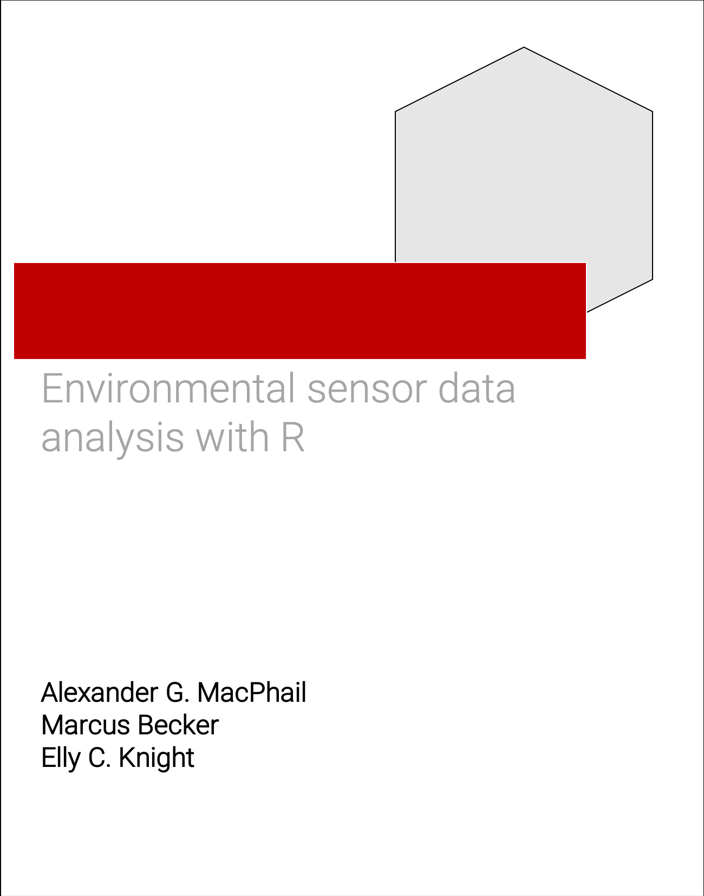

```{r include=FALSE, warning=F, message=F}
# Include initial packages
library(tinytex)
library(kableExtra)

# Automatically create a bib database for R packages
knitr::write_bib(c(
  .packages(), 'bookdown', 'knitr', 'rmarkdown'
), 'packages.bib')

library(tidyverse)
library(lubridate)
library(fitdistrplus)
library(furrr)
library(sf)
library(purrr)
library(scales)
library(doParallel)
library(tools)
library(gamlss)
library(gamlss.dist)
library(vegan)
library(pipeR)
library(gamlss.add)
library(progress)
library(progressr)
library(plotly)
library(fs)
library(lme4)
library(lutz)
library(lmerTest)
library(vctrs)
library(extraDistr)
library(broom)

#save.image("book.RData")
load("book.RData")

knitr::opts_chunk$set(echo = TRUE)
knitr::opts_chunk$set(engine.opts = list(bash = "-l"))
knitr::is_html_output()
```

# Preface {-}

`wildRtrax` (pronounced *‘wilder tracks’*) is an R package to help environmental sensor data users to create full-cycle work flows from data management to analytics.

`wildRtrax` is a versatile R package that is specifically designed for users of environmental sensor data. The name `wildRtrax` is a playful nod to the wild nature of environmental data and the tracks or paths that users can create with this package to manage and analyze their data.

With `wildRtrax`, users can easily create end-to-end workflows for managing and analyzing environmental sensor data. The package provides a wide range of tools and functions that streamline the entire data lifecycle, from data import and cleaning to data visualization and statistical analysis.

One of the key strengths of `wildRtrax` is its flexibility, allowing users to work with diverse types of environmental sensor data, such as autonomous recording units and remote cameras. The package includes a set of functions for data manipulation, data visualization, and data analysis, making it a comprehensive toolkit for environmental sensor data users.

`wildRtrax` also promotes reproducibility in data analysis by providing a consistent and organized framework for managing data and analysis workflows. This helps users to maintain transparency and integrity in their research, making it easier to share and reproduce results.



## Who is this book for?

This book is intended to be a valuable resource for anyone working with environmental sensor data and seeking to manage it using R. It is suitable for both experienced users and those new to the subject, as it is written in a clear and accessible style. While the book is designed to be user-friendly, it also contains advanced concepts and functions that may require additional reading to fully understand. The authors encourage readers to engage and provide feedback, as the book and work flows will continue to evolve with the software. The content relies on understand of the following R packages:

* [`tidyverse`](https://www.tidyverse.org/) mainly `dplyr` and `purrr` for data tidying and functional programming
* [`fs`](https://www.tidyverse.org/blog/2018/01/fs-1.0.0/) for file system operations
* [`lubridate`](https://lubridate.tidyverse.org/) for dealing with dates and times
* [`sf`](https://r-spatial.github.io/sf/) for simple features mapping

## How should I read this book?

For any given environmental sensor, the general workflow is outlined below and how this book fits into the bigger picture of environmental sensor data management are bolded. To effectively use this book to manage environmental sensor data, follow these steps:

1. [**Understanding the basics**](#acoustic-data-management-basics)
2. Collecting data
3. [**Data pre-processing**](#acoustic-data-pre-processing)
4. [Data processing](https://www.wildtrax.ca/home/resources/guide/acoustic-data/acoustic-tagging-methods.html) and [verification](https://www.wildtrax.ca/home/resources/guide/acoustic-data/species-verification.html) using WildTrax
5. [**Data analysis**](#acoustic-data-analysis)
6. Reporting

Keep the following tips in mind as well:

* Start with the basics and build upon them as you progress through the book.
* Use the sidebar menu to guide your reading and keep you organized
* Review the information periodically to reinforce your understanding and keep the information fresh in your mind

:::: {.didyouknow data-latex=""}
::: {.left data-latex=""}
The *Did you know?* sections will provide additional information about a function or work flow.
:::
::::

:::: {.dangerbox data-latex=""}
::: {.left data-latex=""}
The *Keep in mind* sections will warn you when there is something you should think about before running a function or designing a study, for example.
:::
::::

## What is **WildTrax**?

[**WildTrax**](https://www.wildtrax.ca) is a web-enabled portal designed to manage, store, process, share and discover environmental sensor data and the  **biological data** extracted from the media. WildTrax was developed by the [Alberta Biodiversity Monitoring Institute](https://abmi.ca). `wildRtrax` serves as a parallel design and indicator to WildTrax for future analytics and functionalities.

## Why did you build `wildRtrax`?

By outlining a standardized and harmonized procedure for data intake, quality control, processing and verification of acoustic data from autonomous recording units (ARUs), `wildRtrax` and WildTrax hope to provide open work flows for using ARUs to answer meaningful biological questions in order to inform conservation and decision-making.

Developing parallel-track design between an R package and a web-enabled software like WildTrax can significantly improve the software development process. It allows for simultaneous development and testing of both applications, reducing the chances of errors and incompatibilities, and formalizing data structures and APIs across a network of different applications.

## Impact and intentions

`wildRtrax` strives to maintain independent, scientifically credible, relevant, accessible, and transparent language and code. By doing so, we hope to provide unbiased and accurate information products that are easily understood by anyone. Our values are grounded in leadership, accuracy, ingenuity, passion, personal initiative and teamwork in the field of environmental sensor data as we seek to inspire users to engage in responsible resource management. Our team values personal initiative and teamwork, and we encourage learning, feedback, to its shared success. We are passionate about our work and the impact it has on the environment, and we continuously work to fuel better products and processes through innovative ideas.

You can visit the [Alberta Biodiversity Monitoring Institute](https://abmi.ca/home/about-us/our-vision-mission.html) for more information.

## Installing the package

You can install `wildRtrax` directly from this repository with:

```r
install.packages("remotes")
remotes::install_github("ABbiodiversity/wildRtrax")
```

Or the development version with:

```r
remotes::install_github("ABbiodiversity/wildRtrax@development")
```

## Usage

All functions begin with a `wt_*` prefix. Column names and metadata align with the WildTrax infrastructure. The goal is to follow the work flow of pre-processing, linking with WildTrax, download and analysis.

## Acknowledgements

* The [Alberta Biodiversity Monitoring Institute](https://abmi.ca) supports and funds all operations surrounding `wildRtrax` and [WildTrax](https://www.wildtrax.ca).
* Many thanks to [Dr. Richard Hedley](https://richardwhedley.wordpress.com/) for providing the basis for the `wt_wac_info` internal function for wac file support.

