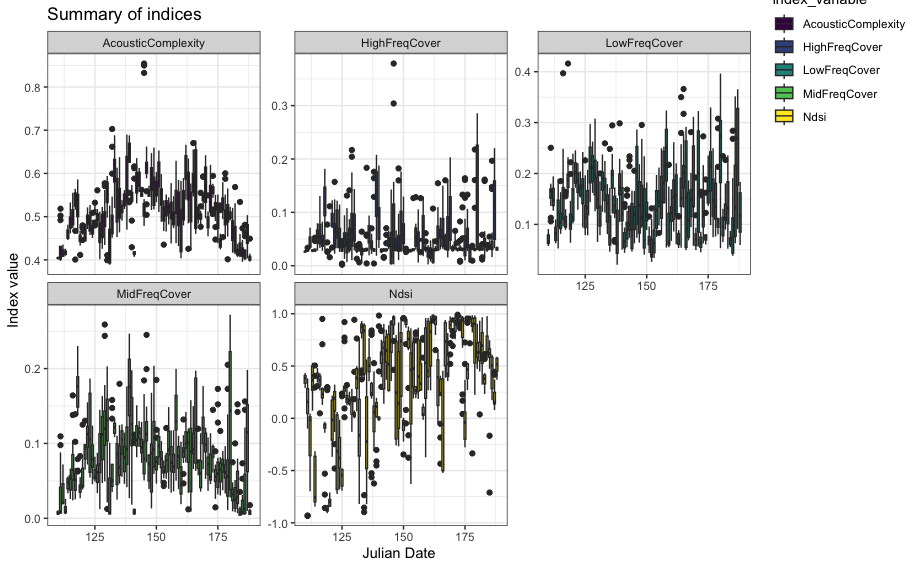
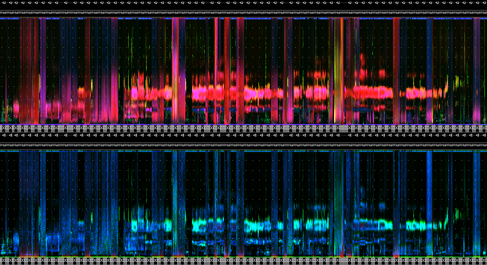

The following set of functions help to pre-process and organize audio and corresponding metadata. In conjunction, these tools allow you to select recordings parameterized to a specific study design.

- \code`wt_audio_scanner()` scans a directory of audio files and prepares them in a tibble with WildTrax formatted columns
- \code`wt_run_ap()` allows you to generate acoustic indices and false-colour spectrograms from a \code`wt_audio_scanner()` tibble, while \code`wt_glean_ap()` wrangles the output into summary plots and long-duration false-colour spectrograms
- \code`wt_signal_level()` detects signals in audio based on amplitude thresholds
- \code`wt_chop()` divides a large audio file into shorter segments
- \code`wt_make_aru_tasks()`, \code`wt_songscope_tags()` and \code`wt_kaleidoscope_tags()` allow you to link media to tasks and to generate tags from recognizer or classifier results from [Songscope](https://www.wildlifeacoustics.com/resources/faqs/song-scope-is-no-longer-supported) and [Kaleidoscope](https://www.wildlifeacoustics.com/products/kaleidoscope-pro)

```{r, include = FALSE, echo = F, include = T, warning = F, message = F}
knitr::opts_chunk$set(
  collapse = TRUE,
  comment = '#>'
)

library(wildrtrax)
library(dplyr)

# Set the directory path
load("package.RData")
#save.image("book.RData")

```

## Scanning audio files from a directory

The `wt_audio_scanner()` function reads in audio files (either wac, wav or flac format) from a local directory and outputs useful metadata.

```{r, echo=TRUE, include=TRUE, eval=F, warning = F, message = F}
# Plan futures
future::plan(multisession)

# Scan data
if (dir.exists(".")) {
  wt_audio_scanner(path = ".", file_type = "wav", extra_cols = T)
} else {
  'Can\'\t find this directory'
}

```

You might want to select recordings between certain times of day or year, or filter recordings based on some criteria.

```{r, echo=TRUE, include=TRUE, eval=T, warning = F, message = F}
files %>%
  dplyr::select(-file_path)

```

```{r, echo=TRUE, include=TRUE, eval=T, warning = F, message = F}

files %>%
  dplyr::mutate(hour = as.numeric(format(recording_date_time, "%H"))) %>%
  dplyr::filter(julian == 176, 
         hour %in% c(4:8))

```

## Running the QUT Ecoacoustics AnalysisPrograms software on a wt_* standard data set

The `wt_run_ap()` function allows you to run the QUT Analysis Programs [(AP.exe)](https://ap.qut.ecoacoustics.info/) on your audio data. AP generates acoustic index values and false-colour spectrograms for each audio minute of data. Note that you must have the AP program installed on your computer. See more here [(Towsey et al., 2018)](https://researchoutput.csu.edu.au/ws/portalfiles/portal/28556441/28544328_Published_article.pdf).

```{r echo=TRUE, include=T, eval=F, warning = F, message = F}
# Use the wt_* tibble to execute the AP on the files

wt_run_ap(x = my_files, output_dir = paste0(root, 'ap_outputs'), path_to_ap = '/where/you/store/AP')

```

Then use `wt_glean_ap()` to plot the acoustic index and long-duration false-colour spectrogram (LDFC) results.

```{r, echo=T, include=T, eval=F, warning=F, message, prompt=T, comment=""}
# This example is from ABMI's Ecosystem Health Monitoring program

my_files <- wt_audio_scanner(".../ABMI-986-SE", file_type = "wav", extra_cols = )

wt_glean_ap(my_files %>% 
               dplyr::mutate(hour = as.numeric(format(recording_date_time, "%H"))) %>%
               filter(between(julian,110,220),
                      hour %in% c(0:3,22:23)), input_dir = ".../ap_outputs", purpose = "biotic")

```





## Applying a limited amplitude filter

We can use the `wt_signal_level()` function to search for sounds that exceed a certain amplitude threshold. 

```{r, echo=T, include=TRUE, eval=F, warning=F, message=F}
if (dir.exists(".")) {
  signal_file <- wt_audio_scanner(path = ".", file_type = "wav", extra_cols = T)
} else {
  'Can\'\t find this directory'
}

wt_signal_level(path = signal_file$file_path, 
                     fmin = 0, 
                     fmax = 10000, 
                     threshold = 5, 
                     channel = 'left')

```

```{r, eval = F}
# Run
s
# Return a list object, with parameters stored
str(s)

# We can view the output:
s['output']
# We have eleven detections that exceeded this threshold.

```

# Linking data to WildTrax

Make tasks at any time using a `wt_*` standard data set with `wt_make_aru_tasks()`.

```{r eval=F, message=FALSE, warning=FALSE, include=T}
wt_make_aru_tasks(input = files %>% select(-file_path), task_method = "1SPT", task_length = 180)

```

The function `wt_songscope_tags()` reformats the output obtained from a Wildlife Acoustics Songscope recognizer. This transformation involves converting the recognizer tags into tags that do not have a method type. This makes it possible to upload each hit as a tag in a task. Similarly, the function `wt_kaleidoscope_tags()` performs the same reformatting process, but with Kaleidoscope instead. It is worth noting that this function targeted for sonic and ultrasonic species upload.

```{r eval=F, message=FALSE, warning=FALSE, include=T}
# Convert Songscope output into WildTrax tags
wt_songscope_tags(
  input, 
  output = c("env", "csv"),
  my_output_file = NULL,
  species_code,
  vocalization_type,
  score_filter,
  method = c("USPM", "1SPT"),
  task_length
)

# Convert Kaleidoscope output into WildTrax tags
wt_kaleidoscope_tags(
  input, 
  output,
  tz, 
  freq_bump = T) # Add a frequency buffer to the tag, e.g. 20000 kHz

songscope_tags

```

If you've already uploaded recordings to WildTrax, scan your media using `wt_audio_scanner()` and a relative folder path.

```{r eval=F, message=FALSE, warning=FALSE, include=T}
my_files <- wt_audio_scanner(path = '/my/BigGrid/files', file_type = 'all', extra_cols = F)

```

And then download the project data you wish to compare it to:

```{r eval=F, message=FALSE, warning=FALSE, include=T}
my_projects <- wt_get_download_summary(sensor_id = 'ARU') %>%
  tibble::as_tibble() %>%
  filter(grepl('Big Grids',project)) %>% # Customized as needed
  mutate(data = purrr::map(.x = project_id, .f = ~wt_download_report(project_id = .x, sensor_id = 'ARU', weather_cols = F, reports = 'main')))
```

Alternatively, go to WildTrax to Organization > Recordings > Manage > Download Recordings to get a list of all recordings. Then either filter out or do an anti-join on `location` and `recording_date_time`. That should give you the remaining list of media that has not been processed or uploaded to WildTrax yet.
